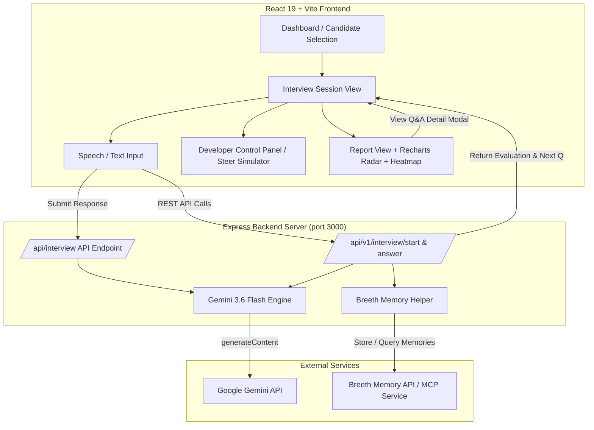

# ABTalks AI — Adaptive Technical Interviewer

An AI-powered, multi-turn adaptive technical evaluation engine that conducts personalized interviews based on the 31-Day Enterprise AI Engineering Cohort Curriculum.

---

## Overview

Traditional technical assessment tools rely on static, pre-scripted questionnaires or multiple-choice quizzes that fail to gauge true engineering depth. They ask the exact same questions regardless of a candidate's background, strengths, or previous answers.

**ABTalks AI** reimagines technical evaluation around a core philosophy: **"Build the interviewer, not the interview."**

Instead of serving static question sets, ABTalks AI acts as an active Senior Technical Interviewer powered by **Gemini 3.6 Flash**. It analyzes the candidate's learning journey, tailors questions dynamically across the **31-day AI cohort curriculum**, probes incomplete answers with adaptive follow-ups, and maintains full conversational context across an 8-turn interview session.

---

## Why ABTalks AI?

Traditional platforms evaluate candidates linearly. ABTalks AI establishes an intelligent feedback loop that continuously adapts to candidate signals:

```
Candidate Context 
  └──> Curriculum Intelligence 
         └──> Interview Planning 
                └──> Adaptive Questioning 
                       └──> Answer Evaluation 
                              └──> Follow-up Reasoning 
                                     └──> Final Report
```

* **Personalized Assessment:** Tailors questions based on candidate background, completed cohort days, target role, and past learning signals.
* **Dynamic Difficulty Scaling:** Strong answers trigger low-level architecture deep dives; partial answers trigger conceptual probing and foundational scaffolding.
* **Curriculum Grounding:** Explicitly maps and tracks candidates against 31 days of Enterprise AI topics (from Local LLMs and Vector DBs to FastMCP, Fine-Tuning, LangGraph, and Production Deployment).
* **Judge Steerability:** Accepts unseen judge prompts and constraints in real time (e.g., latency limits, PEP-8 compliance, zero-trust security) without breaking active session memory.

---

## Key Features

### 1. Personalized Candidate Intelligence
Incorporates candidate profile data, completed curriculum missions, target roles (e.g., *Senior RAG Specialist*, *AI Systems Architect*), and historical learning signals to frame relevant technical scenarios.

### 2. Curriculum-Aware Interviewing
Covers the entire 31-day ABTalks AI Cohort curriculum divided into 8 modules:
* **Module 1 (Days 1–3): Environment & Tooling** — VS Code, Ollama, Qwen2.5-Coder, FastAPI, React Vite, Git & GitHub.
* **Module 2 (Days 4–6): Data Foundations** — Pandas, SQLite, pdfplumber, Tesseract OCR, Chunking, JSONL Knowledge Base.
* **Module 3 (Days 7–10): Embeddings & Vector Search** — Vector Embeddings Math, PCA Visuals, ChromaDB, Pinecone, Hybrid Retrieval Router.
* **Module 4 (Days 11–15): LLM Core, Prompting & Fine-Tuning** — OpenAI SDK, Grounded RAG, Few-Shot & CoT, Function Calling & Pydantic, LoRA & QLoRA Fine-Tuning.
* **Module 5 (Days 16–20): Chatbot Application Build** — FastAPI /chat endpoints, Streamlit/React UI, SSE Response Streaming, Citations, Conversation Memory.
* **Module 6 (Days 21–24): Agentic AI & MCP** — LangChain ReAct Agents, Multi-Agent Orchestration (CrewAI / LangGraph), Model Context Protocol (MCP SDK), Live Tool Integration.
* **Module 7 (Days 25–28): Evaluation, Security & Deployment** — RAG Benchmark Evaluation, Tiktoken Cost Optimization, Prompt Injection Guardrails, Docker & Kubernetes Deployments.
* **Module 8 (Days 29–31): Production & Capstone** — Structured Logging, Prometheus & Grafana Observability, E2E Testing, Final Capstone Demonstration.

### 3. Multi-Turn Adaptive Interview
Guarantees a structured **8-question session** covering **at least 4 unique curriculum days**, with real-time turn-by-turn question generation powered by Gemini 3.6 Flash.

### 4. Intelligent Follow-Ups & Adaptive Branching
If a candidate gives an incomplete or partial answer, the agent generates targeted follow-up probes. When candidates excel, the system escalates question difficulty into low-level architectural mechanics.

### 5. Context & Memory Maintenance
Maintains full session history across all turns. Integrated with the **Breeth Memory API** (`https://mcp.thebreeth.com/mcp` and REST memory endpoints) to persist and retrieve candidate exchange memories across questions.

### 6. Structured Evaluation Framework
Evaluates candidate answers against expected key technical points across 5 core dimensions:
1. **Technical Knowledge**
2. **Conceptual Understanding**
3. **Problem Solving**
4. **System Design**
5. **Communication**

### 7. Rich Visual Analytics
* **7-Topic Cohort Proficiency Spider Chart:** Recharts Radar visualization comparing candidates across key GenAI disciplines.
* **31-Day Curriculum Heatmap Grid:** Visually highlights tested vs. unverified days and pinpoints knowledge gaps.
* **Interactive Q&A Deep-Dive Modal:** Clicking any row in the Question Performance table opens an inspection modal displaying the exact question asked, candidate's raw response, Gemini feedback, covered vs. missed key points, and benchmark answers.

### 8. Judge Steerability & Developer Control Panel
Includes a dedicated **Developer Control Panel** allowing judges to:
* Inject live unseen requirements (*"Inject strict latency constraint (<200ms TTFT)"*, *"Require PEP-8 code style"*, *"Enforce Zero-Trust Bearer Token"*).
* Observe a real-time **Steer Adaptation Log** showing how the AI agent adjusts scoring criteria in flight.
* Use **1-Click Candidate Presets** (*High Performer*, *Needs Remediation*, *Edge Case*).
* Execute a **Fast-Forward** to skip turn-by-turn prompts and instantly generate complete 8-question evaluation reports.

---

## Technical Specification API Contract

### Core Endpoint: `POST /api/interview`

No authentication required. Maintains interview state using `sessionId`.

#### 1. Start Interview
```json
POST /api/interview

{
  "sessionId": "abc-123",
  "candidate": {
    "id": "sana-khan",
    "name": "Sana Sheikh",
    "role": "Senior RAG Specialist",
    "completedDays": [1, 2, 3, 4, 5, 6, 7, 8, 9, 10]
  }
}
```

**Expected Response:**
```json
{
  "reply": "Welcome Sana Sheikh. Let's begin your technical interview. Question 1 (Day 5 - Reading & Processing Unstructured Data): How do you extract and normalize text from scanned healthcare forms using Tesseract OCR?",
  "done": false
}
```

#### 2. Conversation Turn
```json
POST /api/interview

{
  "sessionId": "abc-123",
  "message": "We preprocess images with grayscale thresholding, pass them to Tesseract OCR, and filter noise with regex rules."
}
```

**Expected Response (In Progress):**
```json
{
  "reply": "Good approach. For Question 2 (Day 8 - Vector Databases Overview): How do local ChromaDB collections differ from Pinecone cloud indexes in terms of scaling and latency?",
  "done": false
}
```

#### 3. End Interview (Final Turn Response)
When the interview reaches completion, the endpoint returns:

```json
{
  "reply": "Interview completed. Thank you for walking through the cohort curriculum.",
  "done": true,
  "feedback": {
    "summary": "Candidate demonstrated strong command over data pipelines, vector databases, and RAG retrieval.",
    "strengths": [
      "Deep understanding of OCR text extraction and normalization pipelines",
      "Accurate technical comparison between ChromaDB and Pinecone vector indexing",
      "Clear explanation of LangChain ReAct agent execution loops"
    ],
    "gaps": [
      "Could deepen knowledge in Tiktoken token budget optimization for multi-turn chats",
      "Minor omission regarding Kubernetes health probe configurations"
    ],
    "next": [
      "Review Module 7 Day 26 on performance optimization and Tiktoken budgeting",
      "Practice configuring liveness and readiness probes in Kubernetes manifests"
    ]
  }
}
```

---

## Extended REST API Endpoints

* `POST /api/v1/interview/start` — Initializes a new session with candidate profile & target question count.
* `POST /api/v1/interview/answer` — Processes candidate response, returns evaluation feedback and next question.
* `GET /api/v1/interview/:id/report` — Retrieves full evaluation report JSON.
* `GET /api/v1/curriculum` — Returns the full 31-day curriculum JSON.
* `GET /api/v1/candidates` — Returns candidate profiles and learning signals.
* `GET /api/v1/spec` — Serves OpenAPI specification document.

---

## Tech Stack

* **Frontend Framework:** React 19, TypeScript, Vite 6
* **Styling & UI:** Tailwind CSS 4, Lucide Icons, Canvas Confetti
* **Data Visualization:** Recharts (Radar / Spider Charts)
* **AI Model Engine:** `@google/genai` SDK with **Gemini 3.6 Flash** (`gemini-3.6-flash` model with fallback heuristic engine)
* **Backend Server:** Express 4 on Node.js (transpiled with `tsx` in dev, bundled into standalone `dist/server.cjs` via `esbuild` for production)
* **Memory Integration:** Breeth Memory API (`https://mcp.thebreeth.com/mcp` and REST memory storage endpoints)

---

## Architecture



---

## Environment Variables

| Variable | Description | Required |
|---|---|---|
| `GEMINI_API_KEY` | Google Gemini API Key (used for Gemini 3.6 Flash evaluation and adaptive question generation) | Highly Recommended |
| `BREETH_API_KEY` | Breeth Memory API Key (used for persisting candidate memories to Breeth MCP service) | Optional |

---

## Getting Started

1. **Install dependencies:**
   ```bash
   npm install
   ```

2. **Set environment variables:**
   ```bash
   cp .env.example .env
   ```
   Add your `GEMINI_API_KEY` inside `.env`.

3. **Run Development Server:**
   ```bash
   npm run dev
   ```
   The app will run at `http://localhost:3000`.

4. **Production Build:**
   ```bash
   npm run build
   npm start
   ```

---

## License

Distributed under the MIT License.
